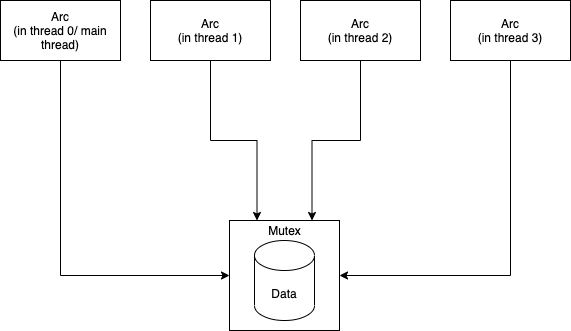
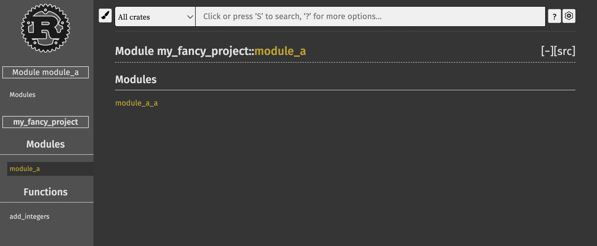

# Engineering Features

## Blanket Trait Implementation

Blanket Implementation is closely related to generics.

```rust,editable
pub trait Hello {
    fn get_name(&self) -> String;
    // zip ---
}

impl<T: Hello> IntroduceSelf for T {
    fn introduce_self(&self) {
        println!("Hello, I'm {}", self.get_name());
    }
}
```

It is much more powerful in a magical way, see the `Rayon` example:

```rust,editable
// Rayon, a parallelization library
use rayon::prelude::*;
pub fn main(){
    let data = Vec::new()
    for i in 0..10000000000000{
        data.push(i);
    }
    // sequential mapping
    let double : Vec<i32> = data.iter().map(|x| 2*x).collect();
    // just change one line, a paralleled mapping is done
    let parallel_double : Vec<i32> = data.par_iter().map(|x| 2*x).collect();
}
```

The key recipe for `Rayon` to work is blanket implementation, which enables the developer to bind a new trait(e.g. `ParIter`) to a type that implements trait `Iter`.

## `unsafe` keyword

Basically, except basic syntax correctness checking, code in `unsafe` blocks will not be checked by `rustc` anyway, so you can write Rust just like C/C++ and try not to “blow your whole leg off”. 

But, beside this extreme case, we can use `unsafe` to get rid of some overhead.

And one basic rule is that `unsafe`-qualified functions can only be used in `unsafe` blocks.

```rust,editable
pub fn main(){
    let numbers = vec![1, 2, 3, 4, 5];
    for i in 0..numbers.len() {
        // safe Vec<T>::get() returns Option<T>
        let number = numbers.get(i).unwrap(); // some overhead
        let number_for_sure = unsafe { numbers.get_unchecked(i) };
        println!("Sure it is {}", number_for_sure);
    }
}
```


## Global Variable

Global mutable variables are discouraged and strictly constrained to use because it is harmful for concurrent safety.

But constants and immutable `static` variable can be safely used

```rust,editable
const CONST_DATA: [u32; 4] = [1, 2, 3, 4];
const CONST_INT: i32 = 1;
static IMMUT_BOOL: bool = false;
static IMMUT_STRING: String = String::from("failed attempt");// compile error, since only const functions are allowed, but String::from is not const
const CONST_STRING: String = String::from("failed attempt"); // compile error, since only const functions are allowed, but String::from is not const
```

`static mut` variables can be `unsafe`ly used.

```rust,editable
static mut MUT_BOOL : bool = false;
pub fn main(){
    unsafe{
        println!("{}", MUT_BOOL);
        MUT_BOOL = false;
    }
}
```

## Concurrent Safety

If you want to share immutable data across threads, you can simply copy the data (if it’s not large), or you can create multiple `Rc` (i.e., reference cell) that are smart pointers counting the number of references at run time. `Rc` is similar to `shared_ptr` in C++.

If mutable data are shared across threads, concurrent read-write safety must be considered. So you need `Mutex` and `Arc`(i.e., atomic reference cell) to safeguard your data.

An example of mutable data sharing across threads.

```rust,editable
use std::sync::{Mutex, Arc, MutexGuard};
use std::thread;
pub fn main(){
    let thread_num = 3;
    let mut handles = Vec::new();
    let values_created_in_threads: Vec<i32> = Vec::new();
    let guarded_values = Mutex::new(values_created_in_threads); // pass shared data to a mutex
    let guarded_value_arc = Arc::new(guarded_values); // create atomic reference counter from the shared mutex
    for i in 0..thread_num {
        // clone an Arc for each thread so that they own different Arcs
        let arc_for_one_thread = Arc::clone(&guarded_value_arc);
        let thread_handle = thread::spawn(move || {
            let mut vec_guard = arc_for_one_thread.lock().unwrap(); // type is MutexGuard<Vec<i32>> (a smart pointer), acquire the lock and take the reference to shared value
            vec_guard.push(i);
        });
        handles.push(thread_handle);
    }
    // join threads
    for handle in handles{
        handle.join().unwrap();
    }
    // print values in main thread
    for i in guarded_value_arc.lock().unwrap().iter(){
        println!("value : {}", i);
    }
}
```



For massage passing concurrency and more details, see [Chapter 16 Fearless concurrency](https://doc.rust-lang.org/book/ch16-00-concurrency.html) and its prerequisite [Chapter 15 Smart Pointers](https://doc.rust-lang.org/book/ch15-00-smart-pointers.html).

## Testing

Rust has a builtin comprehensive testing system. You can define a test module with macro `#[cfg(test)]` and define a test case by decorating a function in a test module by macro `#[test]`.

```rust,editable
#[cfg(test)]
mod test_mod{
    struct HelperStruct{..} // can define anything, a test module is a regular module
    #[test]
    fn test_case_1(){
        assert!(true);
    }
    
    fn helper_func() -> bool{
        true
    }
    
    #[test]
    fn test_case_2(){
        assert!(helper_func());
    }
    
    #[test]
    fn test_case_3()->Result<i32, SomeError>{ // test case can have Result<T,E> as return value
        if true{
            Ok(0)
        }else{
            Err(SomeError::new())
        }
    }
}
```

You can, of course, choose to run a test suite or single test case. For more details, see [Chapter 11 Writing Automated Tests](https://doc.rust-lang.org/book/ch11-00-testing.html).

We can also do inline tests in our documentation (see later), which is a good engineering practice to keep documentation and functions of a program always aligned.

## Documentation

Documentation in Rust supports full-fledged Markdown.

Simple documentation comments for functions, structs and enums are like

```rust,editable
///
/// This is a simple add function
///
/// # Example
/// ```
/// assert_eq!(2, my_fancy_project::add_integers(1, 1));
/// ```
pub fn add_integers(x: i32, y: i32) -> i32 {
    x + y
}
```

 The code blocks in documentation are taken as test cases when `cargo test` is run, which is inline tests.

To document a module, the syntax is

```rust,editable
pub mod simple_mod{
    //! This is a simple module
    //! # h1
    //! ## h2
}
```

When you run `cargo doc` in the project root, documentation pages are automatically generated.

Rendered web pages in web browser:

